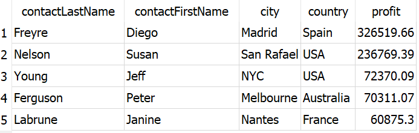
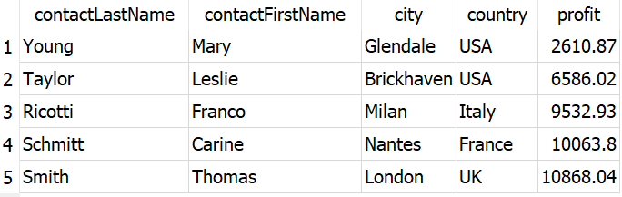
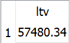

# Customers-and-Products-Analysis-Using-SQL
It is important that a Product company extract key performance indicators (KPIs) to make smarter decisions. This saves time, resources, and money. In this project, I analyzed data from a sales record database for scale model cars and extracted information for decision-making.
A good analysis always starts with the right questions, Through this project, I want to answer the following questions
* Which products should we order more of or less of?
* How should we tailor marketing and communication strategies to customer behaviors?
* How much can we spend on acquiring new customers?
## Exploreing the Data Base
I used scale model cars data base and it contains 8 tables in total:
* Customers: customer data like Customer id( or serial number), Name, contact information along with Sales employee number is available.
* Employees: all the information regarding the employee is provided along with their employee id, office code, reporting manager, etc
* Offices: sales office information is available. All the offices have thier own unique code.
* Orders: customers' sales orders details like order number, customer number, dates are present
* OrderDetails: sales order line for each sales order, it contains the order number, the product code along with quantity column
* Payments: customers' payment details are recorded
* Products: a list of scale model cars, this is the complete list of product along with availabe quantity, prodcut description, price, etc.
* ProductLines: a list of product line categories along with their description.

Using the below code, a table is generated such that each table name is taken as a sting, and its number of columns and rows are counted.

```
SELECT 'customers' AS TableName, (SELECT COUNT(*) FROM pragma_table_info('customers')) AS NumColumns, COUNT(*) AS NumRows FROM customers
UNION ALL
SELECT 'employees' AS TableName, (SELECT COUNT(*) FROM pragma_table_info('employees')) AS NumColumns, COUNT(*) AS NumRows FROM employees
UNION ALL
SELECT 'offices' AS TableName, (SELECT COUNT(*) FROM pragma_table_info('offices')) AS NumColumns, COUNT(*) AS NumRows FROM offices
UNION ALL
SELECT 'orderdetails' AS TableName, (SELECT COUNT(*) FROM pragma_table_info('orderdetails')) AS NumColumns, COUNT(*) AS NumRows FROM orderdetails
UNION ALL
SELECT 'orders' AS TableName, (SELECT COUNT(*) FROM pragma_table_info('orders')) AS NumColumns, COUNT(*) AS NumRows FROM orders
UNION ALL
SELECT 'payments' AS TableName, (SELECT COUNT(*) FROM pragma_table_info('payments')) AS NumColumns, COUNT(*) AS NumRows FROM payments
UNION ALL
SELECT 'productlines' AS TableName, (SELECT COUNT(*) FROM pragma_table_info('productlines')) AS NumColumns, COUNT(*) AS NumRows FROM productlines
UNION ALL
SELECT 'products' AS TableName, (SELECT COUNT(*) FROM pragma_table_info('products')) AS NumColumns, COUNT(*) AS NumRows FROM products;
```
Thereby, I got a basic idea of the data:


## Question 1: Which Products Should We Order More of or Less of?
The decision is to be made based on a product's demand, the revenue it generates, and the quantity available with us.
So I used two parameters that considers the above three paramaters into consideration:
* $lowStock = \frac{SUM(quantityOrdered)}{quantityInStock}$
* $productPerformance = SUM(quantityOrdered \cdot priceEach)$

To apply the above formula and thereby obtain the required priority Product, the following code is written:
```
WITH lowStockProducts AS(
	SELECT p.productCode, 
       CAST(od.quantityOrdered * 1.0 / p.quantityInStock AS DECIMAL(10, 2)) AS lowStock
	FROM products AS p
	JOIN (
		SELECT productCode, SUM(quantityOrdered) AS quantityOrdered
		FROM orderdetails
		GROUP BY productCode
	) AS od ON p.productCode = od.productCode
	GROUP BY p.productCode
	ORDER BY lowStock DESC
),
TopProducts AS(
	SELECT od.productCode,
			(quantityOrdered * priceEach) AS productPerformance
	FROM orderdetails od
	GROUP BY od.productCode
)
SELECT lsp.productCode, lsp.lowStock, tp.productPerformance
FROM LowStockProducts lsp
JOIN TopProducts tp ON lsp.productCode = tp.productCode
WHERE lsp.productCode IN (SELECT productCode FROM LowStockProducts)
ORDER BY lsp.lowStock DESC;
```
## Question 2: How Should We Match Marketing and Communication Strategies to Customer Behavior?
To answer this question I need to explore the customer information. One idea is to divide the most engaged customers - VIP who bring highr profit to the company from the less engaged customers. So as per the division we may organize some events to drive loyalty for the VIPs and launch a campaign for the less engaged.
On exploring the data we know every customer have an unique customerNumber, and he can place various orders with different orderNumbers.
Note: under one orderNumber there may be many unique products
So thereby the profit made by a customer can be calculated as follows:
* $profit = SUM(quantityOrdered * (priceEach - buyPrice))$
Code:
```
SELECT o.customerNumber, SUM(quantityOrdered * (priceEach - buyPrice)) AS profit
  FROM products p
  JOIN orderdetails od
    ON p.productCode = od.productCode
  JOIN orders o
    ON o.orderNumber = od.orderNumber
 GROUP BY o.customerNumber
 ORDER BY profit DESC;
```
On accordingly creating a CET from above query I obtained the top five VIP custmers and the top five least engaged customers:

### Top five VIP customers



### Top five Least Engaged Customers



## Question 3: How Much Can We Spend on Acquiring New Customers?
Firstly I tried to find the number of new customers percentile, and the revenue percentage over the years. On doing so I found a decrease in the count starting from 2003, and the store has no new customer since september of 2004. So it is worth to spend money on obtaining new customers.
To determine how much amount of money we can spend aquiring new customer, I calculated the customer lifetime value(LTV), LTV is the average amount of money a customer generates, so based on that value one can decide how much to spend on marketing.
Code"
```
WITH payment_with_year_month_table AS (
SELECT *, 
       CAST(SUBSTR(paymentDate, 1,4) AS INTEGER)*100 + CAST(SUBSTR(paymentDate, 6,7) AS INTEGER) AS year_month
  FROM payments p
),
customers_by_month_table AS (
SELECT p1.year_month, COUNT(*) AS number_of_customers, SUM(p1.amount) AS total
  FROM payment_with_year_month_table p1
 GROUP BY p1.year_month
),
new_customers_by_month_table AS (
SELECT p1.year_month, 
       COUNT(*) AS number_of_new_customers,
       SUM(p1.amount) AS new_customer_total,
       (SELECT number_of_customers
          FROM customers_by_month_table c
        WHERE c.year_month = p1.year_month) AS number_of_customers,
       (SELECT total
          FROM customers_by_month_table c
         WHERE c.year_month = p1.year_month) AS total
  FROM payment_with_year_month_table p1
 WHERE p1.customerNumber NOT IN (SELECT customerNumber
                                   FROM payment_with_year_month_table p2
                                  WHERE p2.year_month < p1.year_month)
 GROUP BY p1.year_month
),
customer_profit_by_month AS (
    SELECT p1.year_month, 
           (SUM(od.quantityOrdered * (od.priceEach - p.buyPrice)) * 1.0) / c.number_of_customers AS avg_customer_profit
    FROM orderdetails od
    JOIN products p ON od.productCode = p.productCode
    JOIN orders o ON od.orderNumber = o.orderNumber
    JOIN payment_with_year_month_table p1 ON o.customerNumber = p1.customerNumber
    JOIN customers_by_month_table c ON p1.year_month = c.year_month
    GROUP BY p1.year_month
)

SELECT 
    ncbmt.year_month,
    ROUND(ncbmt.number_of_new_customers * 100.0 / ncbmt.number_of_customers, 1) AS number_of_new_customers_props,
    ROUND(ncbmt.new_customer_total * 100.0 / ncbmt.total, 1) AS new_customers_total_props,
    ROUND(cpbm.avg_customer_profit, 2) AS average_customer_profit
FROM 
    new_customers_by_month_table ncbmt
JOIN 
    customer_profit_by_month cpbm ON ncbmt.year_month = cpbm.year_month;
```
### LTV


